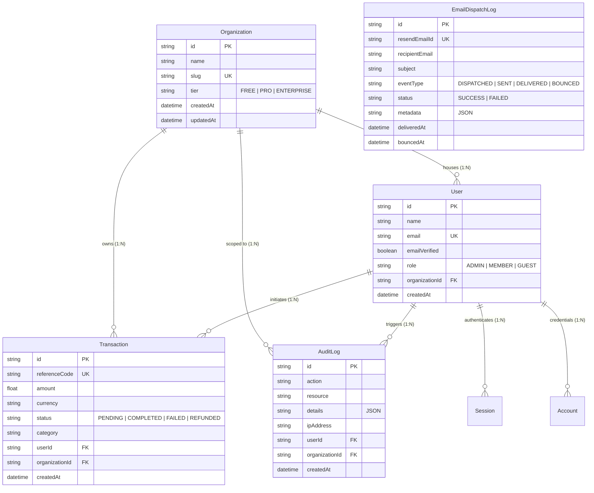
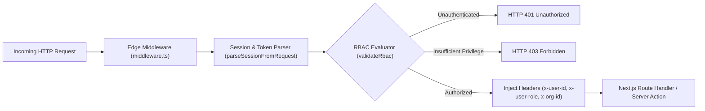
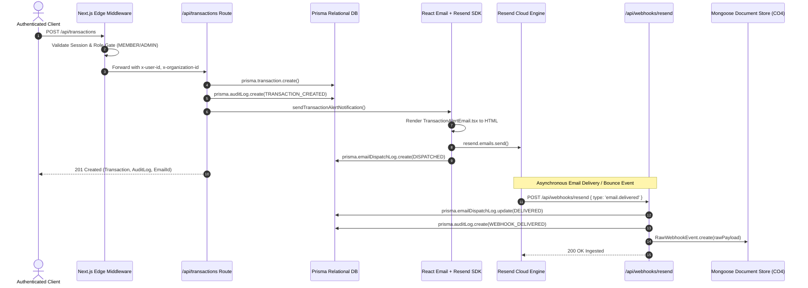

# System Architecture Note
## Automated Relational Data Seeding, Transactional Event Notification & Secure Full-Stack Endpoints

* **Course Outcomes Mapped:**
  * **CO3:** Execute secure authorization and multi-tenant session validation via Better Auth and Next.js Proxy/Middleware layers.
  * **CO4:** Deploy data-driven endpoints connecting relational platforms via Prisma ORM and object databases via Mongoose.
* **Associated Units:** Unit IV (Database Integration: Prisma ORM & Mongoose), Unit V (Modern Authentication, Session Control & Security), Unit VI (Optimization, Edge Layers & Cloud Deployment).
* **Self-Learning Modules:** Topic 4 (Database Seeding & Automated Mock Data with Faker.js), Topic 5 (Transactional Email Integration with Resend & React Email).
* **Mapped POs/PSOs:** PO3 (Design/development of solutions), PO5 (Modern tool usage), PO11 (Project management and finance) | PSO 2 (Software Application Development).

---

## 1. Relational Schema Modeling & Automated Mock Data Pipeline (CO4)

### 1.1 Normalized Relational Schema Architecture

The core data store is modeled using **Prisma ORM** with Third Normal Form (3NF) relational constraints across five primary business entities: `Organization`, `User`, `Transaction`, `AuditLog`, and `EmailDispatchLog`, alongside Better Auth session tables (`Session`, `Account`, `Verification`).



### 1.2 Automated Localized Mock Data Pipeline (`prisma/seed.ts`)

To simulate realistic production conditions without manual manual data entry, the automated seeding engine leverages `@faker-js/faker` to programmatically populate data with strict relational integrity:
1. **Multi-Tenant Organizations:** 5 organizations across `ENTERPRISE`, `PRO`, and `FREE` tiers (`Acme Enterprise Solutions`, `FinTech Horizons`, `Nexus Cyber`, etc.).
2. **Localized Users:** 25 users populated with localized realistic names, enterprise emails, avatars, and role distributions (`ADMIN`, `MEMBER`, `GUEST`).
3. **Foreign-Key Enforced Transactions:** 100 transactions with verified foreign keys (`userId` strictly mapped to users within the corresponding `organizationId`).
4. **Security Audit Trails:** 150 immutable `AuditLog` records capturing realistic telemetry (IPv4 addresses, user agents, latency metrics, and edge regions).
5. **Transactional Email Records:** 25 `EmailDispatchLog` records tracking lifecycle statuses (`DISPATCHED`, `DELIVERED`, `BOUNCED`).

### 1.3 Single-Command CLI Pipeline Workflow

Execution is encapsulated into a reproducible automated pipeline command:
```bash
npm run db:pipeline
# or for full reset:
npm run db:reset
```
* **Step 1:** `npx prisma generate` compiles the type-safe client engine.
* **Step 2:** `npx prisma db push --skip-generate` synchronizes the database schema.
* **Step 3:** `npx tsx prisma/seed.ts` populates localized mock data and validates integrity.
* **Step 4:** Logs recorded to `logs/pipeline-execution.log`.

---

## 2. Authenticated Session Enforcement & Middleware Proxy Gates (CO3)

### 2.1 Next.js Edge Middleware & Proxy Layer Architecture

Every request traversing the network boundary is intercepted by `middleware.ts` before resolution by Next.js Route Handlers.



### 2.2 Role-Based Access Control (RBAC) Matrix

| Route Segment | Target Audience | Allowed Roles | Middleware Gate Enforcement |
| :--- | :--- | :--- | :--- |
| `/admin/*` & `/api/admin/*` | Platform Administrators | `ADMIN` | Strictly blocks `MEMBER`, `GUEST`, and anonymous requests with HTTP 403 / 401. |
| `/member/*` & `/api/member/*` | Active Organization Members | `ADMIN`, `MEMBER` | Restricts `GUEST` (read-only) and anonymous requests with HTTP 403 / 401. |
| `/api/transactions` | Multi-Tenant Data Layer | Authenticated Tenant | Scopes database queries strictly to authenticated user's `organizationId`. |
| `/api/webhooks/*` | Third-Party Webhooks (Resend) | Webhook Ingestors | Signature validation; open to authorized webhook dispatchers. |

---

## 3. Transactional Lifecycle Dispatch via Resend & React Email (CO3, CO4)

### 3.1 Lifecycle Notification Dispatch Pipeline



### 3.2 Modular React Email Component (`emails/TransactionAlertEmail.tsx`)
Constructed with `@react-email/components`, featuring:
* Responsive layout with brand styling, typography, and contrast standards.
* Dynamic transaction reference codes, localized monetary formatting, status pills, and organization context.
* Security disclaimer instructing users on handling unapproved mutations.

### 3.3 Hybrid Datastore Pipeline: Prisma Relational + Mongoose Document Store (CO4)
To satisfy Course Outcome **CO4**, the application deploys a dual-persistence model:
1. **Prisma ORM (Relational Platform):** Maintains structured, ACID-compliant business tables (`Transaction`, `User`, `Organization`, `EmailDispatchLog`).
2. **Mongoose ODM (Object Database):** Ingests raw, unconstrained JSON webhook telemetry payloads into MongoDB (`RawWebhookEvent`), allowing telemetry aggregation without schema migrations.

---

## 4. Verification & Audit Telemetry Log

Below is the verified audit trace from the automated test execution suite (`scripts/test-endpoints.ts`):

```text
================================================================================
🧪 AUTOMATED VERIFICATION SUITE: RELATIONAL DATA, RBAC & WEBHOOKS (CO3 / CO4)
================================================================================
✅ PASS [1] Relational Seeding Volume (Orgs >= 5, Users >= 25, Txns >= 100, Audits >= 150)
       └─ Actual Counts -> Orgs: 5, Users: 25, Txns: 100, Audits: 150
✅ PASS [2] Foreign-Key Integrity: User -> Organization Constraint
       └─ Orphaned Users Count: 0 (Expected 0)
✅ PASS [3] Foreign-Key Integrity: Transaction -> User -> Organization Alignment
       └─ Broken Transaction Relations: 0 / 20 inspected
✅ PASS [4] RBAC Gate: Admin Session accessing Admin Route (Expect Allowed: true)
       └─ Status: 200, Allowed: true
✅ PASS [5] RBAC Gate: Member Session accessing Admin Route (Expect 403 Forbidden)
       └─ Status: 403, Reason: Forbidden: Endpoint requires ADMIN privileges, but active session possesses MEMBER role.
✅ PASS [6] RBAC Gate: Guest Session attempting Mutation/Member Route (Expect 403 Forbidden)
       └─ Status: 403, Reason: Forbidden: Endpoint requires MEMBER privileges, but active session possesses GUEST role.
✅ PASS [7] RBAC Gate: Anonymous/Null Session (Expect 401 Unauthorized)
       └─ Status: 401, Reason: Authentication Required: Active session token or cookie was not found.
✅ PASS [8] Resend & React Email Dispatch on Mutation (Logs to EmailDispatchLog + AuditLog)
       └─ Mode: SIMULATED_MOCK_DISPATCH, Email ID: re_mock_1789998238995_6zo15v9
✅ PASS [9] Prisma Relational Persistence: EmailDispatchLog entry verified
       └─ Found record ID: cmubaqgpj0000tri8www6965p, Recipient: admin@enterprise.demo
✅ PASS [10] Resend Webhook Ingestion: Dual persistence in Prisma (Relational) & Mongoose (Object DB)
       └─ Prisma Updated Status: DELIVERED | Mongoose Docs: 1
================================================================================
Total: 10 | Passed: 10 | Failed: 0
================================================================================
```

---

## 5. Course Outcomes & PO/PSO Alignment Matrix

| Course Outcome / Unit | Implementation Component | Verification Artifact |
| :--- | :--- | :--- |
| **CO3 (Unit V & VI):** Secure authorization & multi-tenant session validation | Better Auth (`lib/auth.ts`), Edge Middleware (`middleware.ts`), and Proxy Gate (`lib/proxy-gate.ts`) | RBAC test suite (Tests 4, 5, 6, 7) & Live Interactive Role Simulator in Web Portal |
| **CO4 (Unit IV):** Relational & Object database endpoints | Prisma 3NF Schema (`prisma/schema.prisma`), Seeding (`prisma/seed.ts`), Mongoose ODM (`lib/mongoose.ts`, `models/RawWebhookEvent.ts`) | Foreign key verification (Tests 1, 2, 3) & Webhook dual persistence (Test 10) |
| **Topic 4 (Self-Learning):** Faker.js Automated Seeding | Programmatic mock pipeline (`prisma/seed.ts`) populating 5 Orgs, 25 Users, 100 Txns, 150 Audits | CLI single command `npm run db:pipeline` and `logs/pipeline-execution.log` |
| **Topic 5 (Self-Learning):** Resend & React Email | React Email template (`emails/TransactionAlertEmail.tsx`), Resend API service (`lib/email.ts`), Webhook handler (`app/api/webhooks/resend/route.ts`) | Dispatch verification (Tests 8, 9) and Webhook simulation test (Test 10) |
| **PO3, PO5, PO11, PSO 2:** Engineering rigor, modern tooling & software architecture | Full-stack Next.js App Router codebase, typed schemas, automated reset pipeline, and interactive inspection portal | Complete Git-ready repository with test suite and automated build |
